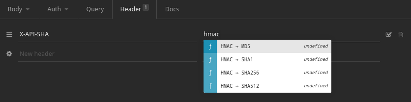
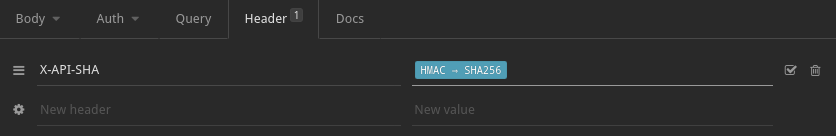
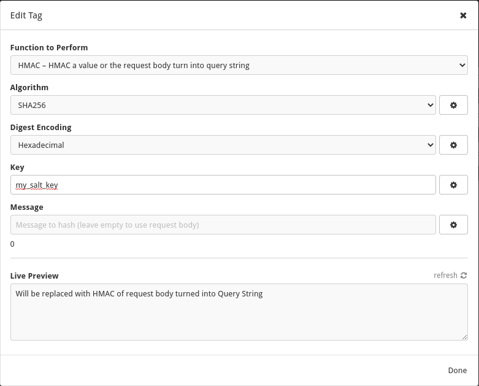
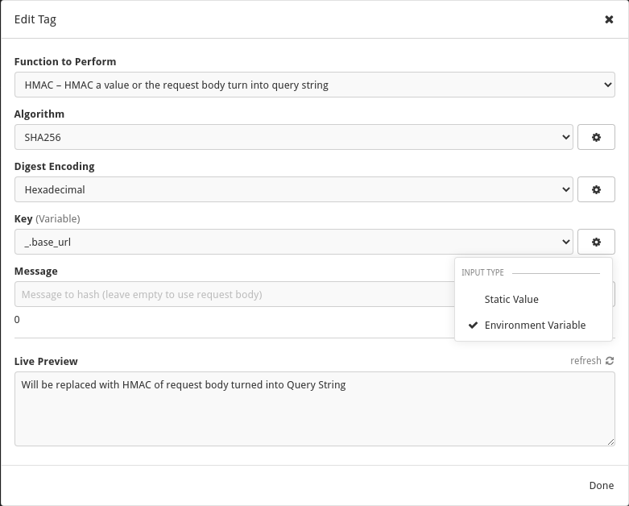

 
# plugin HMAC request body into query string for [Insomnia](https://insomnia.rest)

Based on [Template tag for HMAC by Grunka](https://github.com/grunka/insomnia-plugin-request-body-hmac)

## Install

1. In Insomnia, go to _Application_ and select _Preferences_
2. Click on _Plugins_
3. Paste `insomnia-plugin-request-body-hmac-query-string` into the package name field
4. Click on _Install Plugin_

## Use
1. Typing "hmac"
   

2. Select hashing algorithm
   

3. Add a key
   

4. Or select key from your env
   

## License

[MIT License](./LICENSE)
